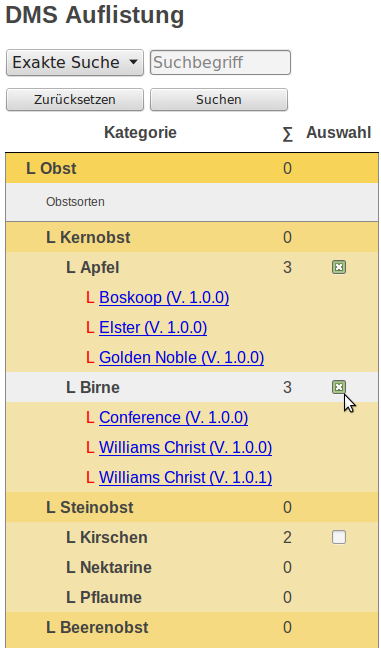

# Benutzerhandbuch

Hier erhalten Sie Informationen, wie Sie das DMS benutzen.

## Inhalt
* Auflistung der Dokumente im Frontend **(DMS-Auflistung)**
    * Dokumente einer Kategorie anzeigen oder ausblenden
    * Alle Dokumente anzeigen oder ausblenden
    * Suchfunktion
* Verwaltungsansicht im Frontend **(DMS-Auflistung)**
	* Dokumente hochladen 
    * Hinweismeldungen (Meldungen die einem bei der Arbeit mit dem ContaoDMS begegnen können ;-) )
    
---

# Auflistung der Dokumente im Frontend (DMS-Auflistung)

**Gliederung der DMS-Auflistung:**

---

* Suchfunktion  

---

<table>
 <tr>
   	<th>Kategorien</th>
    <th>Anzahl</th>
    <th>Auswahl</th>
 </tr>
 <tr>
   	<td>Die Kategorien als Baumstruktur.</td>
    <td>Die Anzahl der in der jeweiligen Kategorie enthaltenden (veröffentlichten) Dokumente.</td>
    <td>Sobald sich Dokumente in einer Kategorie befinden und das Mitglied das Leserecht hat, wird eine Checkbox angezeigt die bei Ativierung die Dokumente der Kategorie anzeigt.
     </td>
 </tr>     
</table>    

---

* Anzahl gefundener Dokumente

---

* Buttons **Alle Dokumente anzeigen** oder **Alle Dokumente ausblenden**

---
**Und jetzt noch mal als Screenshot:**

---

## Dokumente einer Kategorie anzeigen oder ausblenden

Die in einer Kategorie enthaltenen Dokumente lassen sich mit der Checkbox ein-, und ausblenden. 

## Alle Dokumente anzeigen oder ausblenden

Sie können mit Hilfe der Buttons am Ende der Dokumentenliste auch alle Dokumente ein-, bzw. ausblenden

---

## Suchfunktion

Es kann nach Dokumenten gesucht werden. Dafür werden die zwei Suchoptionen **Exakte Suche** sowie **Ähnlichkeitssuche** angeboten.

Die Schaltfläche **Zurücksetzen** löscht den Suchfilter wieder.

Als Suchergebnis bleiben die Auswahlfelder der Kategorien eingeblendet, die Dokumente mit dem Suchbegriff enthalten. Alle anderen werden ausgeblendet. 

In der folgenden Abb. wurde bspw. nach "Boskopp" gesucht. Die Kategorie "Äpfel" enhält ein Dokument mit diesem Suchbegriff und das Auswahlfeld wird eingeblendet.

---

---
# Verwaltungsansicht im Frontend (DMS-Verwaltung)
Über die Verwaltungsansicht laden sie Dokumente hoch. Über die Funktion "Verwalten" stehen die Werkzeuge Veröffentlichen oder ausblenden, löschen und Bearbeiten der Dokumenteigenschaften zur Verfügung.

---

## Dokumente hochladen
Nachfolgend sind die Schritte beschrieben wie sie Dokumente hochladen.

Klicken sie in der Verwaltungsansicht auf **Hochladen**:

Dann weiter auf **Durchsuchen**:

Wählen sie das hochzuladene Dokument und bestätigen sie mit **Öffnen**:

Klicken sie nun auf **Hochladen**:

Bestimmen sie die **Dokumenteigenschaften**:

---

## Hinweismeldungen
Nachfolgend sind Hinweismeldungen aufgeführt, die Ihnen beim Arbeiten mit dem ContaoDMS begegnen können:

* Die nachfolgende Meldung erhalten sie, wenn ein Dateityp hochgeladen wird der für diese Kategorie nicht freigegeben ist. 

* Die folgende Meldung erhalten sie beim Upload, wenn das System festgestellt, dass es noch mindestens ein Dokument mit gleichem Namen in einer anderen Kategorie gibt. 

