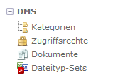
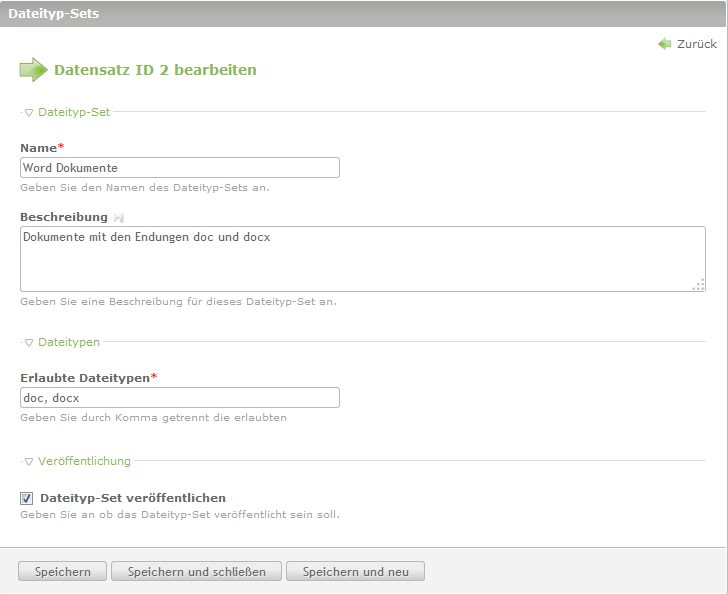

# Dateityp-Sets

Hier erhalten Sie Informationen über die Ansicht für Dateityp-Sets.

**Datatyp-Sets** ist ein extra Add-On des ContaoDMS und muss separat installiert werden  
Github: https://github.com/ContaoDMS/dms-FileTypeSets  
Packagist: https://packagist.org/packages/contao-dms/file-type-sets

Sie können ContaoDMS auch als Bundle installieren. Darin ist das Add-On **Datatyp-Sets** enthalten:  
Github: https://github.com/ContaoDMS/bundle-all  
Packagist: https://packagist.org/packages/contao-dms/bundle-all

## Was sind Dateityp-Sets?
Dateityp-Sets enthalten erlaubte Dateitypen die in eine Kategorie abgelegt werden dürfen.  
Die Sets stehen bei der Neuanlage von Kategorien bzw. Anpassung von bestehenden Kategorien zur Verfügung und können leicht ausgewählt werden.

## Dateityp-Sets erstellen
Im Modul DMS → Dateityp-Sets → dann auf „Neues Dateityp-Set“

* **Name:** Aussagekräftigen Namen vergeben (z.B. Word Dokumente)
* **Beschreibung:** optionale Angabe einer Beschreibung
* **Erlaubte Dateitypen:** doc, docx (Gross oder Kleinschreibung spielt keine Rolle)

*Sollen mehrere Dateitypen in einem Set enthalten sein, werden diese im Feld „Erlaubte Dateitypen“ durch Komma getrennt eingetragen. Z.B. pdf, zip oder jpg, gif, tif*

* **Dateityp-Sets veröffentlichen:** Checkbox aktivieren

Jetzt hat man ein Dateityp-Set vom Typ doc und docx angelegt.

Auf diese Weise können beliebig viele Sets angelegt werden.

## Verarbeitung der Dateityp Sets

* Vererbung
* Unifikation
* Anzeige
